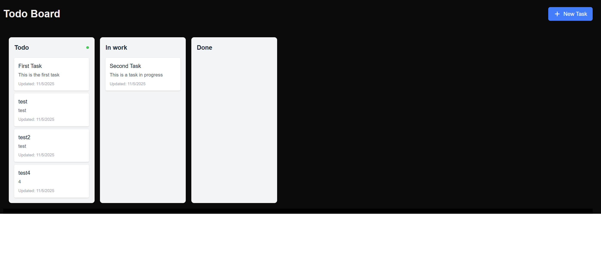

# Deploy to Azure AKS

This is a test project for deploying a simple To-Do List app to Azure Kubernetes Service (AKS). The goal is to learn and experiment with Kubernetes and Terraform for infrastructure as code and cloud deployment.



# Install

use Terraform

or
```bash
# Set environment variables
MY_RESOURCE_GROUP_NAME=pub-sub-kafka-test
REGION=westeurope
MY_AKS_CLUSTER_NAME=pub-sub-kafka-aks

# Create resource group
az group create --name $MY_RESOURCE_GROUP_NAME --location $REGION

# Create AKS cluster
az aks create   --resource-group $MY_RESOURCE_GROUP_NAME   --name $MY_AKS_CLUSTER_NAME   --node-count 1   --generate-ssh-keys

# Get AKS credentials
az aks get-credentials   --resource-group $MY_RESOURCE_GROUP_NAME   --name $MY_AKS_CLUSTER_NAME

# Verify connection
kubectl get nodes

# Deploy application
kubectl apply -f kubernetes.yaml


```

### To Delete
az group delete --name $MY_RESOURCE_GROUP_NAME


---

## install uing Helm
 
helm install pub-sub  . -f values.yaml


install Grafana loki

helm repo add grafana https://grafana.github.io/helm-charts

helm repo update

helm install loki grafana/loki -f values.yaml
 
 

---

# Deploy to AWS EKS

```bash
# TODO: Add AWS EKS deployment commands
```

---

# Deploy to OpenStack

```bash
# TODO: Add OpenStack deployment commands
```
